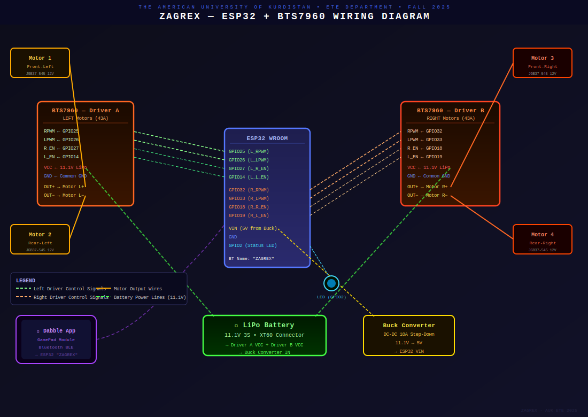

# ⚔️ ZAGREX — ESP32 Combat Robot

**AUK Robotics Competition — Fall 2025**  
Electronic & Telecommunication Engineering Department  
The American University of Kurdistan

---

## 🤖 About

Zagrex is a high-power 4WD RC combat robot built for the AUK Robotics War Event.  
It uses an ESP32 with dual BTS7960 43A motor drivers for precise, high-current motor  
control, delivering strong pushing force and reliable performance in competition.

---

## 📸 Photos

---

## ⚙️ Hardware

| Component | Spec |
|---|---|
| Microcontroller | ESP32 WROOM |
| Motor Drivers | 2× BTS7960 (43A each) |
| Motors | 4× JGB37-545 12V DC Gear Motor (1000 RPM) |
| Battery | 11.1V LiPo 3S via XT60 |
| Power Regulation | DC-DC 10A Step-Down Converter (→ 5V) |
| Connector | XT60 |

---

## 📌 Pin Map

| ESP32 GPIO | BTS7960 Pin | Side |
|---|---|---|
| GPIO25 | RPWM | Left Forward |
| GPIO26 | LPWM | Left Backward |
| GPIO27 | R_EN | Left Enable |
| GPIO14 | L_EN | Left Enable |
| GPIO32 | RPWM | Right Forward |
| GPIO33 | LPWM | Right Backward |
| GPIO18 | R_EN | Right Enable |
| GPIO19 | L_EN | Right Enable |
| GPIO2 | — | Status LED |

---

## 🔌 Wiring Diagram

---

## 📱 Controls (Dabble App — GamePad Module)

| Button | Action |
|---|---|
| ↑ Up | Move Forward |
| ↓ Down | Move Backward |
| ← Left | Pivot Left |
| → Right | Pivot Right |
| △ Triangle + ↑ | Full Power Burst Forward |
| △ Triangle + ↓ | Full Power Burst Backward |
| (release) | Stop |

---

## 🔧 Libraries

Install in Arduino IDE → Sketch → Manage Libraries:

- `DabbleESP32` by STEMpedia
- No extra libraries needed (uses ESP32 built-in `ledcSetup`)

---

## 👥 Team

Mahshad · Hero · Haliz · Zhinwar · Zaid · Ala ·  
Matin Rezgar · Mateen Nazar · Mohammed Bassam · Mohammed Saaed

**Supervisors:** Dr. Omar Abdulghafoor · Dr. Ahmed Hamood

---

## 💡 Lessons Learned

- BTS7960 handles high current (18–22A) with no heat issues at 20kHz PWM
- XT60 connectors essential for stable high-current delivery
- Weight distribution is critical for effective pushing power
- Common GND between ESP32 and both drivers is mandatory

---

## 📄 License

MIT License
